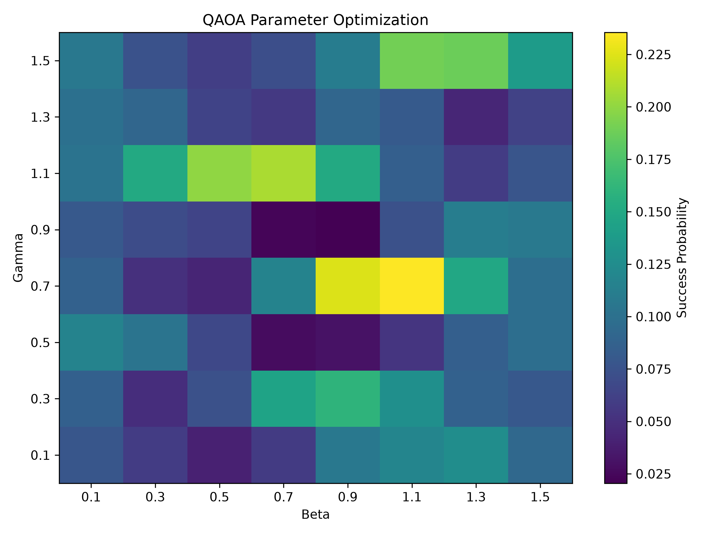
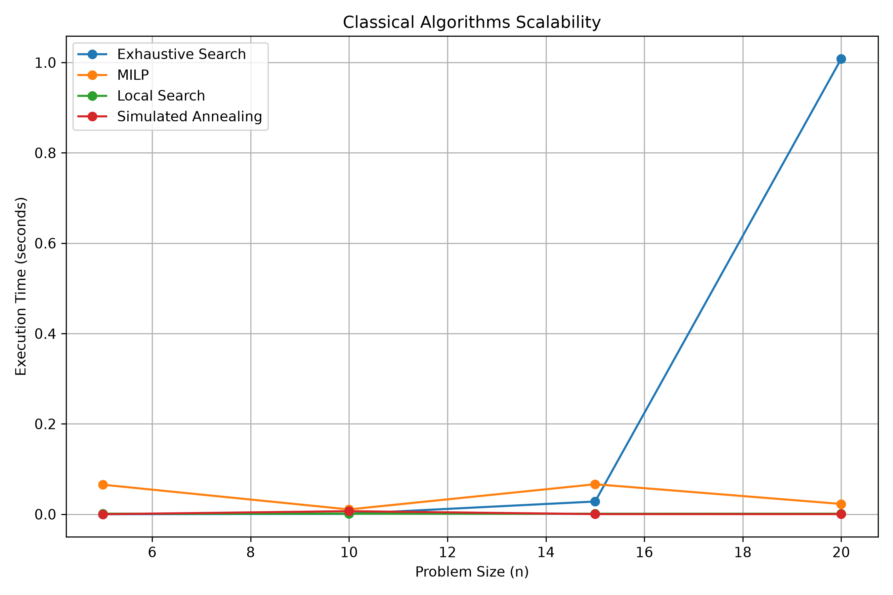
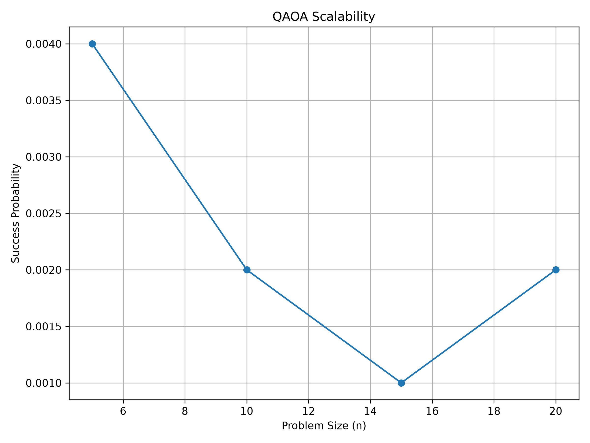
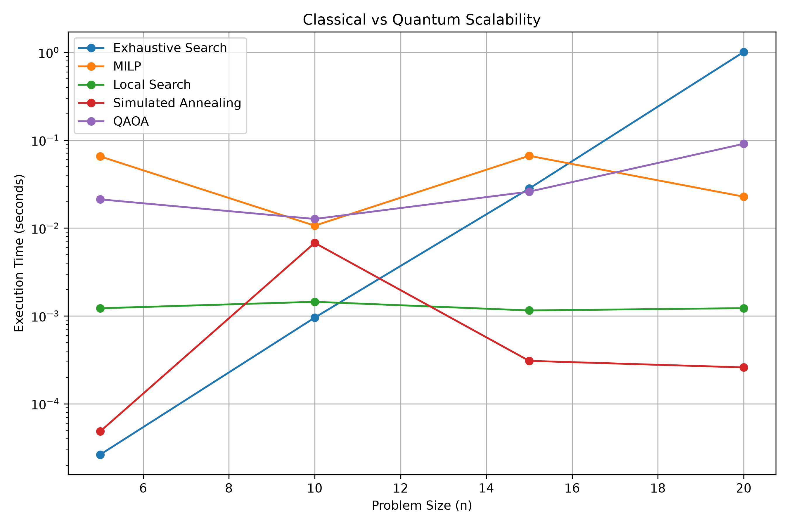
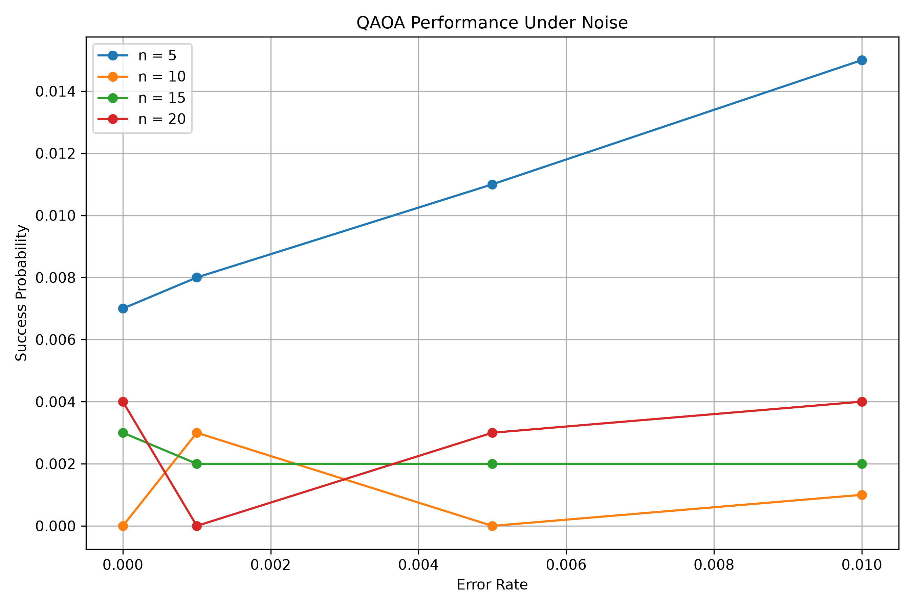

# Quantum Optimization for the Subset Sum Problem

## Overview

This project investigates the use of **Quantum Approximate Optimization Algorithm (QAOA)** for solving the **Subset Sum Problem** and compares its behavior with classical optimization approaches.

The main objective is not to claim a quantum advantage, but to experimentally study:

* the formulation of the problem as a QUBO;
* the conversion from QUBO to an Ising Hamiltonian;
* the construction and simulation of a QAOA circuit;
* QAOA parameter optimization;
* scalability with increasing problem size;
* the effect of noise;
* and the comparison between quantum and classical approaches.

The experiments are performed using **Python, Qiskit, Qiskit Aer, NumPy, Pandas, Matplotlib and OR-Tools**.

---

## Problem: Subset Sum

Given a set of integers

$$
A = \{a_1,a_2,\ldots,a_n\}
$$

and a target value \(T\), the Subset Sum Problem asks whether there exists a binary vector

$$
x_i \in \{0,1\}
$$

such that

$$
\sum_{i=1}^{n} a_i x_i = T.
$$

The problem is formulated as a quadratic unconstrained binary optimization problem (QUBO):

$$
E(x)=\left(\sum_{i=1}^{n}a_i x_i-T\right)^2.
$$

Expanding this expression leads to a quadratic objective that can be mapped to an Ising Hamiltonian and subsequently used by QAOA.

---

## Project Structure

```text
quantum-crypto-optimization/
│
├── src/
│   ├── problem/
│   │   └── subset_sum_problem.py
│   │
│   ├── classical/
│   │   ├── local_search.py
│   │   └── simulated_annealing.py
│   │
│   ├── quantum/
│   │   ├── qubo.py
│   │   ├── ising.py
│   │   ├── qaoa.py
│   │   └── quantum_solver.py
│   │
│   └── utils/
│       ├── benchmarking.py
│       └── visualization.py
│
├── experiments/
│   ├── benchmark_classical.py
│   ├── benchmark_scalability.py
│   ├── benchmark_qaoa.py
│   ├── benchmark_qaoa_grid.py
│   ├── benchmark_qaoa_scalability.py
│   ├── benchmark_noise.py
│   ├── compare_classical_quantum.py
│   └── optimize_qaoa.py
│
├── results/
│   ├── classical/
│   │   └── scalability_results.csv
│   │
│   ├── quantum/
│   │   ├── qaoa_parameter_grid.csv
│   │   ├── qaoa_scalability_results.csv
│   │   └── qaoa_noise_results.csv
│   │
│   └── comparison/
│       └── classical_vs_quantum.csv
│
├── figures/
│   ├── convergence/
│   │   └── qaoa_parameter_heatmap.png
│   │
│   ├── scalability/
│   │   ├── classical_scalability.png
│   │   └── qaoa_scalability.png
│   │
│   ├── comparison/
│   │   └── classical_vs_quantum.png
│   │
│   └── noise/
│       └── qaoa_noise.png
│
├── requirements.txt
└── README.md
```

---

## Methodology

The project follows the following workflow:

```text
Subset Sum Problem
        │
        ▼
      QUBO
        │
        ▼
      Ising
        │
        ▼
   QAOA Circuit
        │
        ▼
 Quantum Simulation
        │
        ├───────────────┐
        ▼               ▼
 Parameter         Noise Analysis
 Optimization
        │
        ▼
 Scalability
        │
        ▼
Classical vs Quantum
 Comparison
```

---

## 1. QUBO Formulation

The Subset Sum problem is converted into a QUBO objective:

$$
E(x)=\left(\sum_i a_i x_i-T\right)^2.
$$

The corresponding matrix is constructed in:

```text
src/quantum/qubo.py
```

The implementation also provides a function for evaluating the energy of a candidate solution.

---

## 2. QUBO to Ising Conversion

The binary variables are transformed using

$$
x_i=\frac{1-z_i}{2},
$$

where

$$
z_i\in\{-1,+1\}.
$$

The resulting formulation is:

$$
E(z)=C+\sum_i h_i z_i+
\sum_{i<j}J_{ij}z_i z_j.
$$

This transformation is implemented in:

```text
src/quantum/ising.py
```

---

## 3. QAOA

A one-layer QAOA circuit is implemented in:

```text
src/quantum/qaoa.py
```

The circuit consists of:

1. Initial uniform superposition;
2. Cost Hamiltonian;
3. Mixer Hamiltonian;
4. Measurement.

The parameters are:

* \(\gamma\): cost Hamiltonian parameter;
* \(\beta\): mixer parameter.

The quantum simulation is performed using **Qiskit Aer**.

---

## 4. QAOA Parameter Optimization

A grid search is performed over different values of \(\gamma\) and \(\beta\).

The experimental results are stored in:

```text
results/quantum/qaoa_parameter_grid.csv
```

The best parameters obtained during the experiment were:

$$
\gamma=0.6
$$

$$
\beta=0.5
$$

with a measured success probability of approximately:

$$
35.9\%.
$$

### Parameter Heatmap



The heatmap illustrates how the QAOA success probability varies according to the two variational parameters.

---

## 5. Classical Scalability

Several classical approaches are benchmarked:

* Exhaustive Search;
* MILP;
* Local Search;
* Simulated Annealing.

The experiments evaluate their execution time for increasing problem sizes.

Results are stored in:

```text
results/classical/scalability_results.csv
```

### Classical Scalability



The results illustrate the different computational behaviors of the classical approaches as the problem size increases.

---

## 6. QAOA Scalability

QAOA is evaluated for several problem sizes:

$$
n\in\{5,10,15,20\}.
$$

For each instance, the success probability and execution time are measured.

Results are stored in:

```text
results/quantum/qaoa_scalability_results.csv
```

### QAOA Scalability



This experiment allows the behavior of the simulated QAOA approach to be studied as the number of qubits increases.

---

## 7. Classical vs Quantum Comparison

The classical approaches are compared with QAOA using the same problem sizes.

The comparison considers:

* execution time;
* solution quality;
* success probability.

The results are stored in:

```text
results/comparison/classical_vs_quantum.csv
```

### Classical vs Quantum



The comparison is intended as an experimental benchmark rather than evidence of quantum advantage.

In particular, QAOA is evaluated through a classical simulator, so the measured execution time includes classical simulation overhead and should not be interpreted as the runtime of a physical quantum computer.

---

## 8. Noise Analysis

The robustness of QAOA is studied by introducing different noise/error rates.

The tested error rates include:

$$
0,\quad 0.001,\quad 0.005,\quad 0.01.
$$

The experiment is performed for several problem sizes.

Results are stored in:

```text
results/quantum/qaoa_noise_results.csv
```

### QAOA Noise Analysis



This experiment studies how the measured probability of obtaining a valid solution changes under different noise levels.

The results should be interpreted carefully because QAOA is evaluated using a simulated noisy environment rather than a real quantum processor.

---

## 9. Experimental Results

The experiments show several important observations.

### QAOA Parameter Optimization

The parameter search identified:

```text
Gamma = 0.6
Beta  = 0.5
```

as the best configuration among the tested grid points, with an observed success probability of approximately **35.9%** for the optimization experiment.

### Classical Methods

Exhaustive Search provides exact solutions but its search space grows exponentially:

$$
O(2^n).
$$

MILP can exploit mathematical optimization techniques and performs substantially better than exhaustive enumeration for some tested instances.

Local Search and Simulated Annealing can be considerably faster, but they do not necessarily return a valid solution for every instance.

### QAOA

QAOA successfully produces valid solutions with non-zero probability, but the probability varies significantly with:

* problem size;
* QAOA parameters;
* random measurement outcomes;
* and noise.

Therefore, these experiments do **not** demonstrate a quantum advantage.

---

## 10. Important Scientific Limitation

This project is an experimental study of quantum optimization.

The QAOA experiments are executed using a classical simulator. Therefore:

> The project does not demonstrate practical quantum advantage.

The purpose is instead to investigate the complete optimization pipeline:

$$
\text{Problem}
\rightarrow
\text{QUBO}
\rightarrow
\text{Ising}
\rightarrow
\text{QAOA}
\rightarrow
\text{Simulation}
\rightarrow
\text{Benchmarking}.
$$

The results highlight both the potential and the current limitations of QAOA for combinatorial optimization.

---

## Installation

Clone the repository and create a Python virtual environment.

```bash
git clone <YOUR_GITHUB_REPOSITORY_URL>

cd quantum-crypto-optimization

python -m venv .venv
```

Activate the environment on Windows:

```powershell
.venv\Scripts\Activate.ps1
```

Install the dependencies:

```bash
pip install -r requirements.txt
```

---

## Running the Experiments

### Classical benchmark

```bash
python -m experiments.benchmark_classical
```

### QAOA benchmark

```bash
python -m experiments.benchmark_qaoa
```

### QAOA parameter optimization

```bash
python -m experiments.optimize_qaoa
```

### Classical scalability

```bash
python -m experiments.benchmark_scalability
```

### QAOA scalability

```bash
python -m experiments.benchmark_qaoa_scalability
```

### Noise benchmark

```bash
python -m experiments.benchmark_noise
```

### Classical vs Quantum comparison

```bash
python -m experiments.compare_classical_quantum
```

### Generate all figures

```bash
python -m src.utils.visualization
```

---

## Technologies

* Python
* NumPy
* Pandas
* Matplotlib
* Qiskit
* Qiskit Aer
* OR-Tools
* Git
* GitHub

---

## Conclusion

This project provides an end-to-end experimental framework for studying QAOA on the Subset Sum Problem.

It demonstrates how a combinatorial optimization problem can be transformed into a QUBO, mapped to an Ising formulation, implemented as a QAOA circuit, simulated, optimized and benchmarked against classical algorithms.

The experiments also investigate scalability and noise, providing a realistic perspective on the current limitations of quantum optimization.

The main conclusion is that **QAOA is an interesting approach for combinatorial optimization, but the experiments performed here do not establish a quantum advantage over classical methods**.
